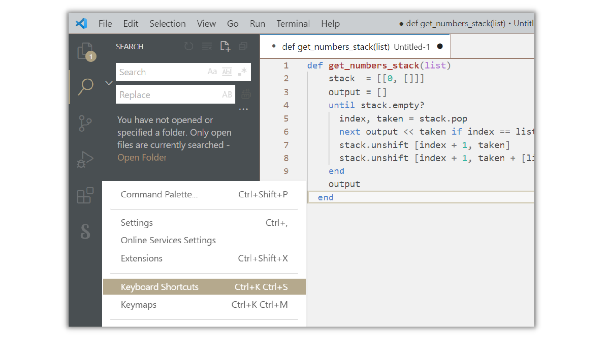
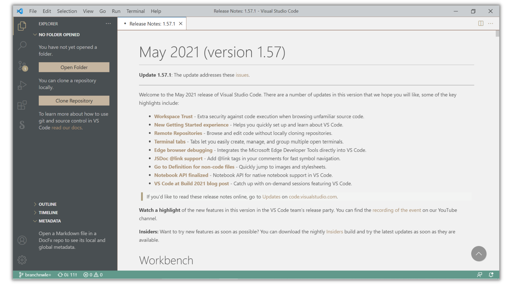
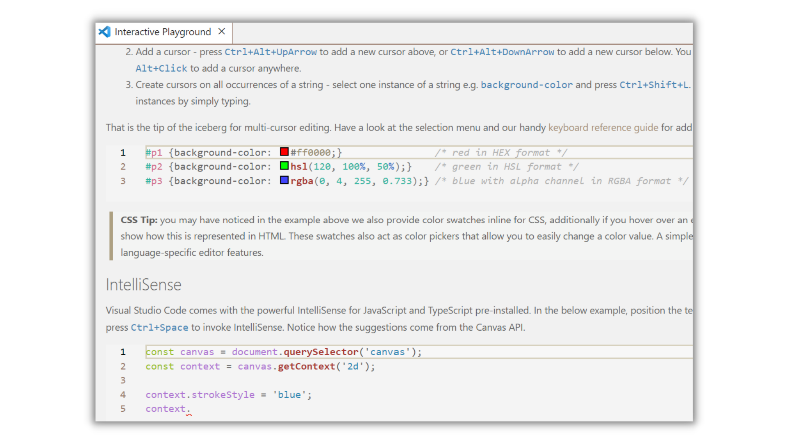
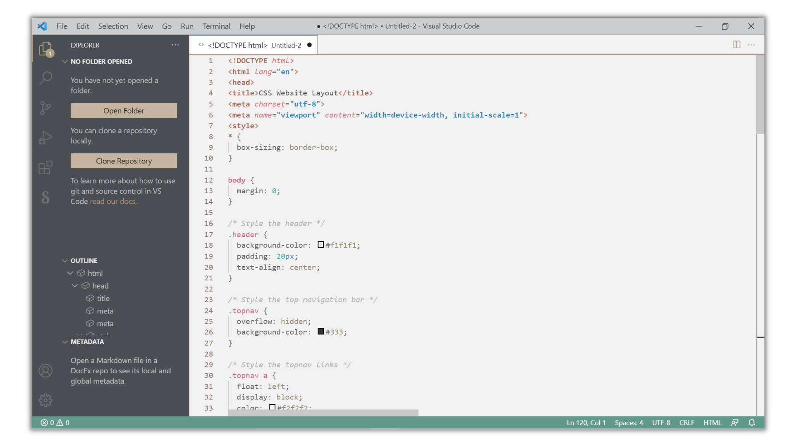
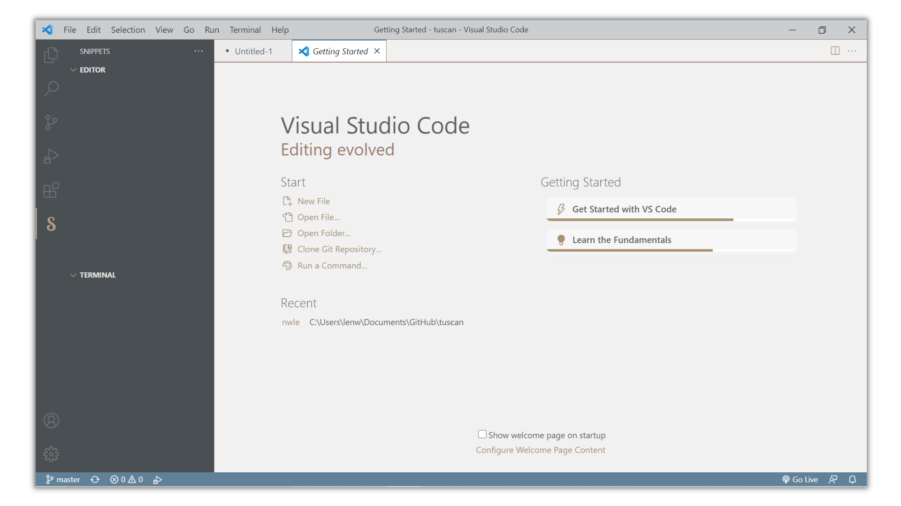
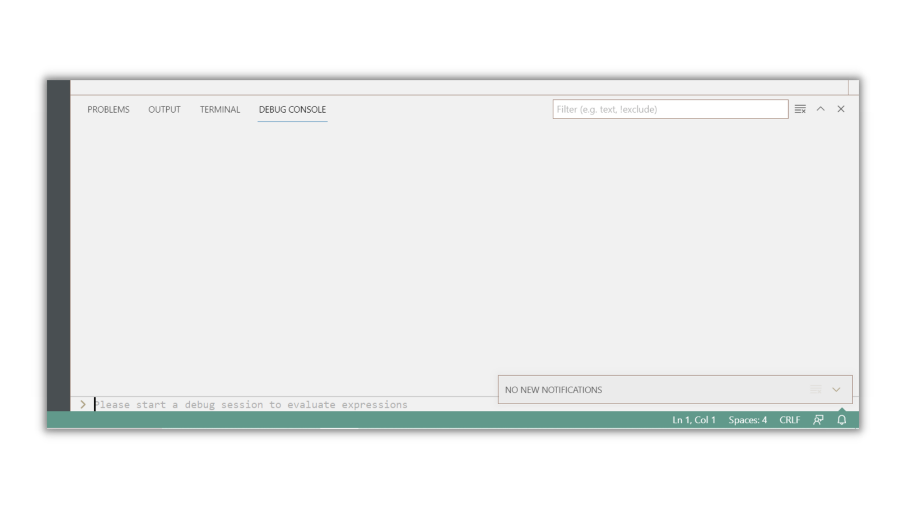

  
**Descriptions**  

🍂  

Inspired by a region with beautiful landscapes in Italy, Tuscany, **tuscan** use muted brown, green, and blue as point colors. 

I hope tuscan users can finally enjoy a soft light theme that does not hurt the eyes.  
  

**Screenshots**  

  
  

**For more information**  
  
<a href="https://www.linkedin.com/in/leonie-nur-wahyuni-768580146/"> <a href="https://github.com/nwle/tuscan">
  
  
**Enjoy!**  
  
Leonie
